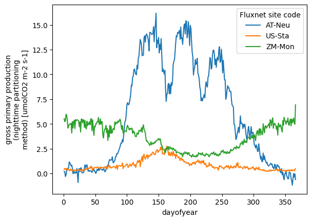

# FLUXNET2015 as Zarr store

Rehost of the [FLUXNET 2015 dataset](https://fluxnet.org/data/fluxnet2015-dataset/) as a Zarr store for easier access.

It currently serves as a demo of what is possible. Only six variables (and some quality flags) are included at the moment.
The total Zarr store size is only 125 MB, so more variables can still be included here on GitHub.

## How to use

You need a Python environment with the following packages installed: `requests aiohttp zarr xarray`

Then you can do:
```python
import xarray as xr
uri = 'https://excited-co2.github.io/zarr-fluxnet2015/fluxnet.zarr'
ds = xr.zarr(uri)
ds["gpp_nt"].sel(
    site=["AT-Neu", "US-Sta", "ZM-Mon"]  # select three sites
).groupby(
    ds["time"].dt.dayofyear  # groupby day-of-year
).mean().plot.line(hue="site")
```


## Citations

Pastorello, G., Trotta, C., Canfora, E. et al. The FLUXNET2015 dataset and the ONEFlux processing pipeline for eddy covariance data. Sci Data 7, 225 (2020). https://doi.org/10.1038/s41597-020-0534-3

## How to reproduce

Download FLUXNET fullset for all sites.

Get page source, paste into links.txt. Then:
```
cat links.txt | grep -oP 'https(\S*)bschilperoort' > stripped_links.txt
xargs -n 1 curl -O < stripped_links.txt
```

Create a python virtual environment:
```
python3 -m venv .venv
source .venv/bin/activate
pip install -r requirements.txt
```

Then run the processor:
```
python3 create_zarr.py
```
